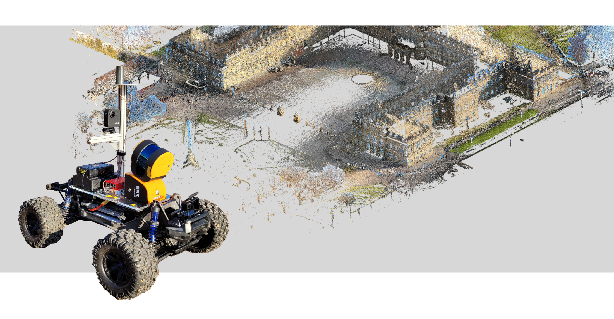

# Slam Integrated Mobile Platform
University project to integrate a laserscanner, GNSS antenna and remote controled vehicle in order to perform SLAM and georeference the results. 



## Overview
This repository includes the processing code for data collected with the SIMP vehicle as well as some example data to run the program. Cloning the master branch will give you the following structure:

```
 your_project_folder/
	│
	├── Code/  
  │   ├── functions/  
	│   ├── `Georeferencing.m` 
	└── Data/  
	    ├── GNSS Trajectories/  
	    ├── GoPro Images/  
      │   └── GoProSchloss/  
      ├── Scan Trajectories/  
	    ├── Scans/  
	    └── output/  
```

The Georeferencing function includes the main code that will be used to call all functions related with this project. To process the example data simply run `Georeferencing.m` and select the corresponding data when prompted. 

The main steps of the program are:
- Loading all necessary data (see Data folder)
- Calculating Time Offset (to connect Scan and GNSS data)
- Coarse trajectory match (as preparation for the ICP-based accurate matching)
- Accurate trajectory match (using temporally closest points of both trajectories)
- Estimate point matching accuracy (statistical values for relative accuracy of matching algorithm)
- Transform point cloud (apply combined transformation)
- Colorize point cloud (uses GoPro Data to determine colors)
- Remove moving objects (to clean up the point cloud)
- Ground classification (to seperate the points by ground and get some semantic information)
- Save final cloud (in Earth-Centered-Earth-Fixed (ECEF) coordinates)

